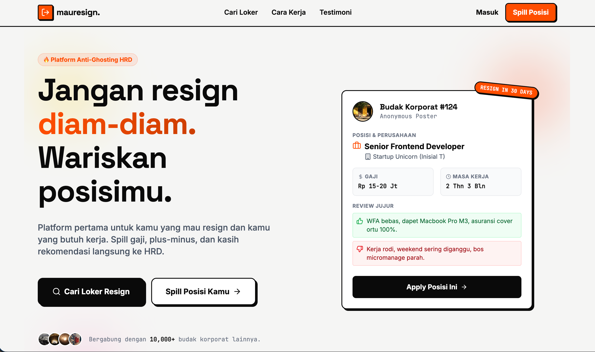

# MauResign (Bukan MauKerja)



Selamat datang di repositori **MauResign**! Ini adalah kebalikan dari portal lowongan kerja biasa. MauResign adalah platform revolusioner untuk para budak korporat yang ingin resign dan mewariskan posisinya kepada mereka yang sedang mencari kerja.

## Fitur Utama

-   **Mewariskan Posisi:** Kamu yang mau resign bisa memberikan informasi lengkap tentang posisi kamu saat ini (gaji, plus-minus, budaya perusahaan, dan rekomendasi langsung).
-   **Anti-Ghosting HRD:** Bagi pencari kerja, kamu bisa mendapatkan informasi orang dalam sebelum lowongan tersebut dipublikasikan secara umum.
-   **Toxic Leaderboard:** Papan peringkat realtime perusahaan dengan tingkat resign tertinggi! 💀
-   **100% Anonim:** Identitas pelapor dijaga kerahasiaannya.

## Tech Stack

Proyek ini dibangun menggunakan teknologi modern:

-   **React 19** - Library UI
-   **Vite 6** - Build tool yang sangat cepat
-   **Tailwind CSS 4** - Framework styling dengan desain Brutalism
-   **Lucide React** - Ikon yang indah dan konsisten
-   **Motion** - Untuk animasi antarmuka yang halus

## Konsep Desain

Landing page ini menggunakan konsep desain **Neo-Brutalism** dengan kontras tinggi (Bayangan tebal, Font *Display* yang bold, dan warna *vibrant* seperti Oranye, Kuning, Pink) untuk memberikan kesan berani, jujur, dan sedikit memberontak.

## Cara Menjalankan Secara Lokal

1.  Pastikan Node.js sudah terinstal.
2.  Install semua dependency:
    ```bash
    npm install
    ```
3.  Jalankan development server:
    ```bash
    npm run dev
    ```
4.  Buka browser dan akses `http://localhost:3000` (atau port lain yang ditampilkan di terminal).

## Build untuk Production

Untuk melakukan build aplikasi, jalankan perintah:

```bash
npm run build
```

Hasil build akan berada di dalam folder `dist`.

---
*Dibangun dengan ❤️ untuk kesejahteraan para pencari kerja dan mereka yang butuh healing dari lingkungan toxic.*
